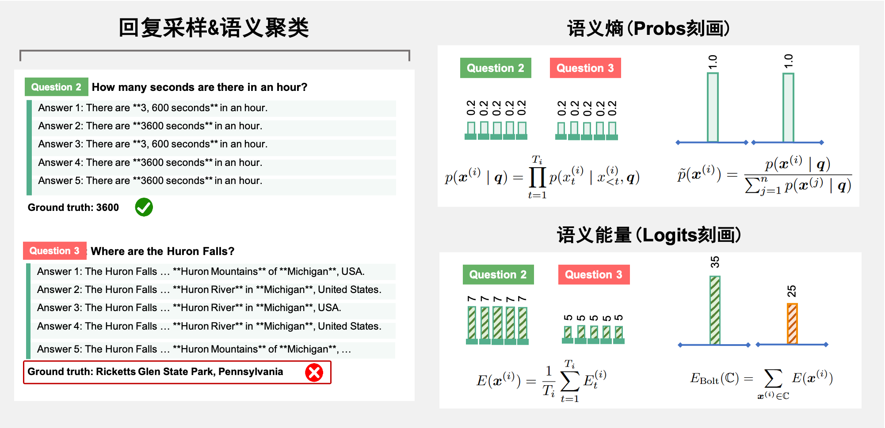

# SemanticEnergy

This repository serves as a temporary repository for **Semantic Energy**. [Paper](https://arxiv.org/abs/2508.14496). For specific implementations, please refer to the code in the notebook. We have uploaded all the intermediate results generated by the models in the `cache_data` [Google drive](https://drive.google.com/file/d/16ykjWpLV1bY82IRFpvMhzHyKIq9Me02J/view?usp=sharing) directory to facilitate the reproduction of experiments.




### Step 1: Sampling Response

Similar to semantic entropy, for a given question, it is necessary to first sample multiple responses. You can refer to the following code to save the required content:

```
messages = [
    {"role": "user", "content": question}
    ]
generated_prompt = tokenizer.apply_chat_template(
            messages,
            tokenize=False,
            add_generation_prompt=True
        ) 
inputs = tokenizer(generated_prompt, return_tensors='pt')
inputs = {k: v.to(model.device) for k, v in inputs.items()}
generated_output = model.generate(
    inputs["input_ids"],
    attention_mask=inputs["attention_mask"],
    max_new_tokens=args.max_tokens,
    temperature=args.temperature,
    top_p=args.top_p,
    top_k=args.top_k,
    do_sample=True,
    return_dict_in_generate=True,
    output_scores=True,
)

# Extract the generated token ids (excluding the prompt)
generated_ids = generated_output.sequences[0][len(inputs["input_ids"][0]):].tolist()
scores = generated_output.scores  # List[tensor: (batch, vocab_size)], len == num_generated_tokens
logits_list = []
probs_list = []
token_ids = []

for step_idx, score_tensor in enumerate(scores):

    """Example: the next-token probability distribution is {'token_id_1': '0.75', 'token_id_2': '0.22', ...},
    the next-token logit distribution is {'token_id_1': '35', 'token_id_2': '28', ...},
    suppose the sampled token is 'token_id_2' """

    logits = score_tensor[0].tolist()  # (vocab_size,)
    token_id = generated_ids[step_idx]
    prob = F.softmax(score_tensor[0], dim=-1)[token_id].item()
    logits_list.append(logits[token_id])  # Save the logit value corresponding to 'token_id_2': 28,
    probs_list.append(prob)              # Save the probability value corresponding to 'token_id_2': 0.22,
    token_ids.append(token_id)           # Save the value :'token_id_2'

```
### Step 2: Semantic Clustering

You can refer to the following code to cluster the different generated responses. Here, we take ```TIGER-Lab/general-verifier``` as an example to analyze semantics, though you can also use other models:

```
class SemanticAnalyser:
    def __init__(self, model_path="TIGER-Lab/general-verifier"):
        self.tokenizer = AutoTokenizer.from_pretrained(model_path)
        self.model = AutoModelForCausalLM.from_pretrained(
            model_path, torch_dtype=torch.float16
        ).cuda()

    def semantic_analyse(self, question, answer_a, answer_b):
        prompt = (
            f"User: ### Question: {question}\n\n"
            f"### Ground Truth Answer: {answer_a}\n\n"
            f"### Student Answer: {answer_b}\n\n"
            "For the above question, please verify if the student's answer is equivalent to the ground truth answer.\n"
            "Do not solve the question by yourself; just check if the student's answer is equivalent to the ground truth answer.\n"
            "If the student's answer is correct, output \"Final Decision: Yes\". If the student's answer is incorrect, output \"Final Decision: No\". Assistant:"
        )

        inputs = self.tokenizer(prompt, return_tensors="pt").to(self.model.device)
        outputs = self.model.generate(
            **inputs,
            max_new_tokens=2025,
            pad_token_id=self.tokenizer.eos_token_id,
            do_sample=False
        )
        print(self.tokenizer.decode(outputs[0][-3:], skip_special_tokens=True))
        return self.tokenizer.decode(outputs[0][-3:], skip_special_tokens=True)

def find_semantic_clusters(question, answer_list, analyser):
    def is_semantic_same(i, j):
        return "Yes" in analyser.semantic_analyse(question, answer_list[i], answer_list[j])
    
    n = len(answer_list)
    clusters = []
    visited = [False] * n
    for i in range(n):
        if visited[i]:
            continue
        cluster = [i]
        visited[i] = True
        
        for j in range(i + 1, n):
            if not visited[j] and is_semantic_same(i, j):
                cluster.append(j)
                visited[j] = True
        clusters.append(tuple(cluster))
    print(len(clusters), f"Clusters: {clusters}")
    return clusters

analyser = SemanticAnalyser()

```

### Step 3: Uncertainty Estimation
The final step is to calculate the Semantic Energy. This paradigm is generally consistent with Semantic Entropy, with the primary difference being that the probability used for estimating uncertainty is replaced with logits. For the code, please refer to ```semantic_energy.ipynb```.

**Reliability of a single response:**
The reliability of a single response is equal to the reliability of the cluster it belongs to. For example, if a question is answered 5 times, and the answers are semantically clustered as ```(answer1, answer2, answer3)``` and ```(answer4, answer5)```, then we can compute the energies of the two clusters, namely ```energy_cluster1``` and ```energy_cluster2```. Consequently, the reliability of ```answer1, answer2, answer3``` is given by the value computed from ```energy_cluster1```, while the reliability of ```answer4, answer5``` is given by the value computed from ```energy_cluster2```.


### Contact Us
You can get in touch with us by sending an email to the corresponding author. If the corresponding author receives the email, they will convey its contents to me. For a faster response, you can directly raise an issue in this project, and I will do my best to reply to your question on the same day.


### Citation

```
@article{ma2025semantic,
  title={Semantic Energy: Detecting LLM Hallucination Beyond Entropy},
  author={Ma, Huan and Pan, Jiadong and Liu, Jing and Chen, Yan and Joey Tianyi Zhou and Wang, Guangyu and Hu, Qinghua and Wu, Hua and Zhang, Changqing and Wang, Haifeng},
  journal={arXiv preprint arXiv:2508.14496},
  year={2025}
}
```
