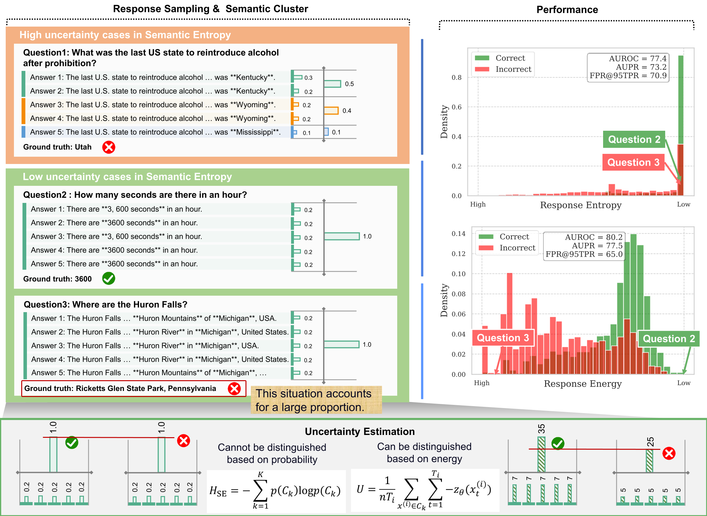

# SemanticEnergy

This repository serves as a temporary repository for **Semantic Energy**. The method is illustrated in the figure below. The paper is a draft currently being updated. For specific implementations, please refer to the code in the notebook. We have uploaded all the intermediate results generated by the models in the `cache_data` [Google drive](https://drive.google.com/file/d/16ykjWpLV1bY82IRFpvMhzHyKIq9Me02J/view?usp=sharing) directory to facilitate the reproduction of experiments.

